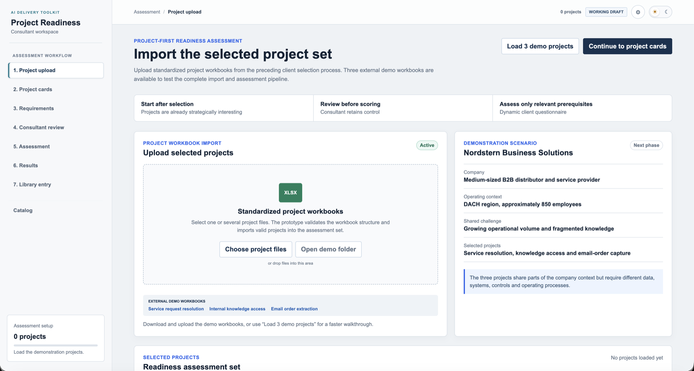
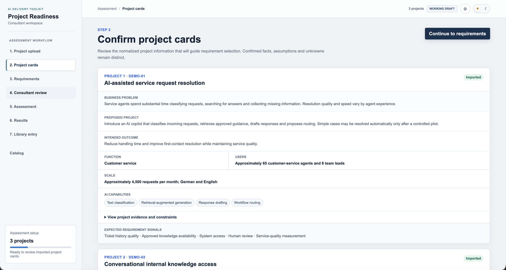
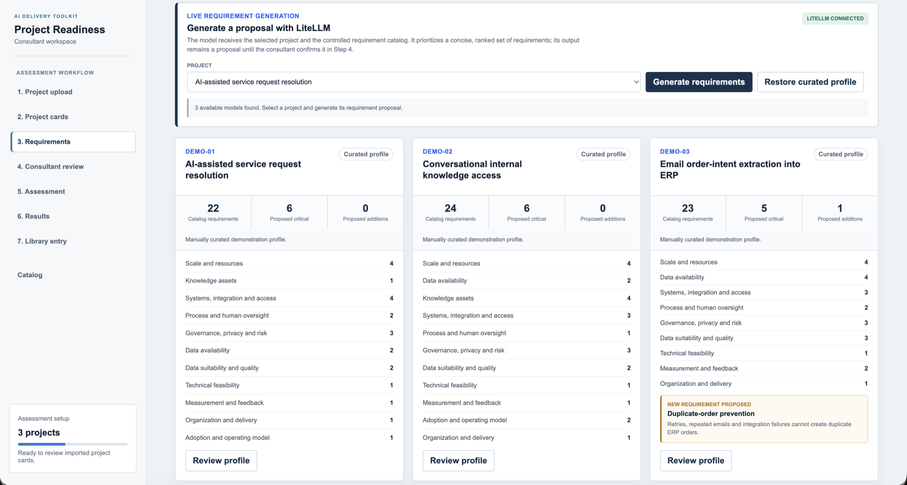
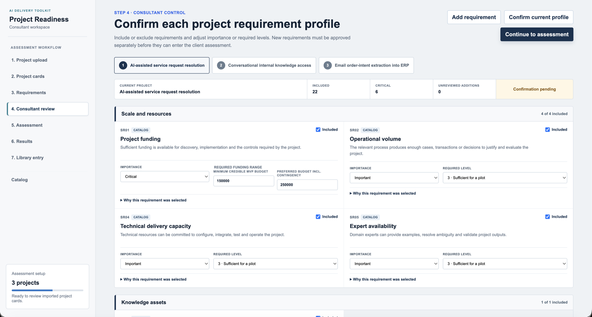
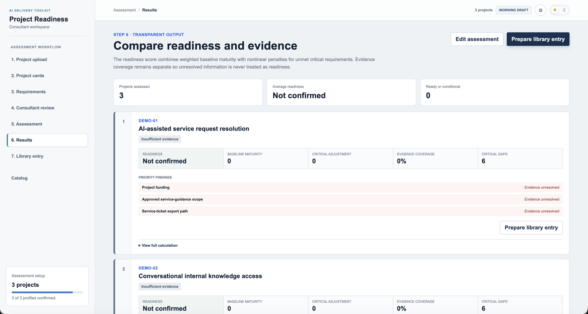
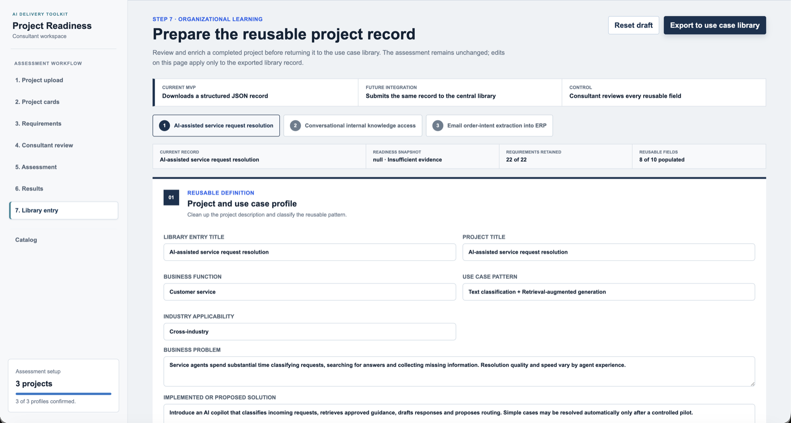
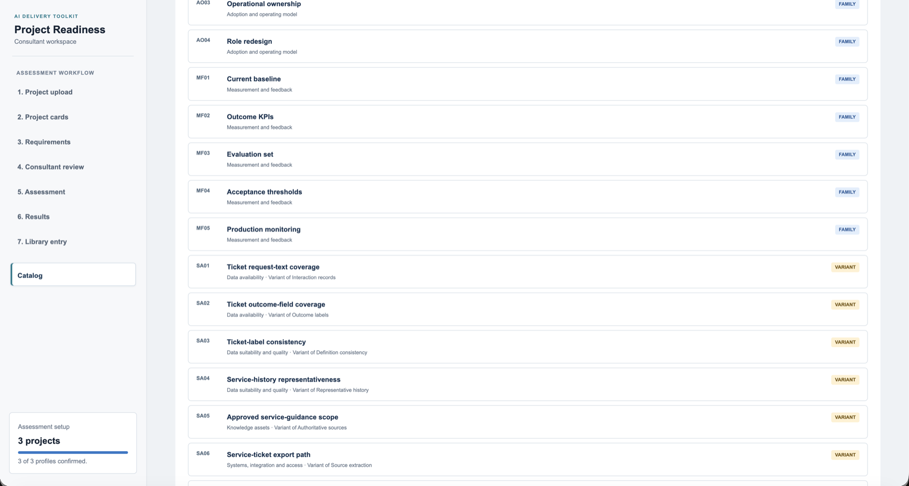

# AI Project Readiness Assessment - Version 2

This is a separate, project-first prototype. It does not depend on fixed use-case IDs or the Version 1 prefilter and weighting matrix.

Current status: functional end-to-end demonstration of the downstream readiness workflow. Standardized Excel project import and live LiteLLM-supported requirement selection are implemented through the local server. The three curated demo projects can be taken from external project workbooks through requirement selection, consultant review, client assessment and transparent results.

The demonstration data is stored in `data/demo-projects.js` so the application continues to work when opened directly as a local file. The scenario contains:

1. AI-assisted service request resolution
2. Conversational internal knowledge access
3. Email order-intent extraction into ERP

## How it works

<table>
<tr>
<td width="38%" valign="top">

**1. Import the project set**

Upload standardized project workbooks, or load the three built-in demo projects to try the full pipeline immediately.

</td>
<td></td>
</tr>
<tr>
<td width="38%" valign="top">

**2. Confirm the normalized project cards**

Each imported project is parsed into a structured card: business problem, proposed solution, scale, users and expected requirement signals.

</td>
<td></td>
</tr>
<tr>
<td width="38%" valign="top">

**3. Generate a live requirement proposal**

Connects to any OpenAI-compatible endpoint (LiteLLM shown here, a local Ollama model works too) to draft a project-specific requirement profile from the 110-entry catalog, including any genuinely new requirements it proposes.

</td>
<td></td>
</tr>
<tr>
<td width="38%" valign="top">

**4. The consultant stays in control**

Every AI-proposed requirement is editable: include or exclude it, adjust importance and required level, with the reasoning behind each selection one click away.

</td>
<td></td>
</tr>
<tr>
<td width="38%" valign="top">

**5. Compare readiness and evidence side by side**

The readiness score combines weighted baseline maturity with a nonlinear penalty for unmet critical requirements. Evidence coverage is tracked separately, so missing information is never silently treated as readiness.

</td>
<td></td>
</tr>
<tr>
<td width="38%" valign="top">

**6. Turn a completed assessment into a reusable record**

Closing out a project captures delivery outcomes and lessons, and prepares a structured export for the shared use-case library.

</td>
<td></td>
</tr>
<tr>
<td width="38%" valign="top">

**7. Browse the underlying requirement catalog**

110 reusable entries (67 families plus 43 project-pattern variants) across 11 categories, each one traceable to where it came from.

</td>
<td></td>
</tr>
</table>

## Demonstration workflow

1. Upload one or more standardized demo project workbooks, or use the built-in quick-load button.
2. Review the normalized project cards and their evidence, assumptions and unknowns.
3. Generate a live requirement proposal through LiteLLM, or retain the curated reference profile.
4. Review each project profile, change inclusion, importance or target levels and approve the project-specific provisional requirement.
5. Run the client assessment using observable 0-4 answer states or load the curated demo responses.
6. Compare readiness, evidence coverage and critical gaps, then expand the full calculation report.
7. Enrich a completed project with delivery outcomes and lessons, review its reusable requirements and export a structured use case library entry.

The demo responses intentionally create different outcomes across the three projects. The headline readiness score starts with the weighted maturity of all answered requirements and then deducts a quadratic penalty for each unmet critical requirement. A one-level critical gap deducts 8 points, a two-level gap 32 points, and larger gaps become correspondingly more consequential. There is no artificial score ceiling: the final score remains calculated, is bounded only to 0-100, and directly determines the decision label. Critical unknowns or insufficient evidence keep the score unconfirmed instead of silently assuming readiness.

The curated profiles use critical requirements sparingly but do not impose a numeric cap. A requirement is critical only when a bounded MVP cannot proceed safely, lawfully or credibly without it and no realistic near-term workaround exists. Project funding is always critical.

### Funding assessment

Project funding uses structured ranges instead of a manually interpreted score. During consultant review, each project receives a minimum credible MVP budget and a preferred budget including contingency. During the client assessment, the customer provides a lower and upper available-funding bound. The application converts the comparison into an internal 0-4 state, using the lower available bound to determine whether the project minimum is securely covered.

## Run with a live model

No credential is stored in the browser application. The included local server holds the key and proxies the requirement-selection request. Any OpenAI-compatible endpoint works — a hosted provider/proxy, or a free local model via [Ollama](https://ollama.com). See `SETUP.md` for the quick version.

1. Copy `llm.env.example` to a new file named `llm.env` in this folder, and fill in:

```text
LITELLM_API_KEY=your-key
LITELLM_BASE_URL=https://your-litellm-host.example/v1
```

The base URL must be the prefix to which `/models` and `/chat/completions` can be appended. Keep the `/v1` suffix when it is part of the URL. For a local Ollama model instead of a hosted provider, use `LITELLM_BASE_URL=http://localhost:11434/v1` and any placeholder value for `LITELLM_API_KEY` (Ollama does not check it).

2. Run the launcher for your OS: `macos/Start Prototype.command` or `windows/Start Prototype.cmd`. From a terminal, `python3 server.py` works on either.
3. The prototype opens at `http://127.0.0.1:8765/`.
4. Load the demo projects and open Step 3.
5. Select a model discovered from the configured `/models` endpoint and choose `Generate requirements`.

The generated output is a proposal, not an automatic decision. It is validated against the controlled catalog and remains editable in the consultant review step. Unknown catalog IDs are ignored, proposed new requirements are isolated for approval, and the curated reference profile remains available as a fallback. The interface displays elapsed time and a model-specific typical duration learned from successful local runs. The consultant can stop waiting or restore the curated profile at any time; the previous profile remains intact until a complete response has passed validation. The server allows up to four minutes for requirement generation, while the prompt contains no hard requirement-count cap.

Before a profile can be confirmed, the review step checks that every selected assessment question is client-ready. Any unresolved project placeholder is shown as an explicit input field and blocks confirmation until it has been replaced with project context.

Opening `index.html` directly still supports the static demonstration, but live generation requires running `server.py` (via the launcher or `python3 server.py`).

## Project workbook import

The external demo workbooks are stored in `demo-project-files/`:

- `DEMO-01.xlsx` - AI-assisted service request resolution
- `DEMO-02.xlsx` - conversational internal knowledge access
- `DEMO-03.xlsx` - email order-intent extraction into ERP

Each workbook keeps project definition, company context, capabilities, data sources, systems, constraints, assumptions, unknowns, evidence and assessment placeholders in separate readable worksheets. Use `Open demo folder` in Step 1 to open their exact location in Finder/Explorer, then select several files at once or drag them into the upload area. Valid projects are normalized into the same internal structure used by the built-in demonstration.

Excel upload requires running the local server (the launcher or `python3 server.py`); direct `file://` mode cannot call the secure local import endpoint.

## Current integration placeholders

- Optional LLM-supported requirement deduplication before admitting new requirements to the shared catalog
- Persistent requirement-library approval workflow
- Saving and exporting completed assessments
- Direct submission of approved project records to a persistent use case library

## Use case library export

The seventh workflow step demonstrates how completed projects can feed organizational learning. It creates an editable export draft without changing the underlying readiness assessment. The consultant can refine the project definition, classify the reusable pattern, document roadblocks, costs, ROI, time to value, other benefits, lessons and comments, and review every retained requirement.

`Export to use case library` currently downloads a JSON file containing:

- export metadata and an anonymization choice
- the reusable project and use case profile
- delivery status, economics, benefits and lessons
- the readiness result snapshot
- catalog lineage and the original assessment snapshot for each retained requirement
- consultant edits, evidence and project-specific requirements

The same record can later become the payload for an authenticated central-library API. No information is transmitted by the current local MVP.

### Optional LLM catalog review

The Library entry page deliberately keeps AI deduplication out of the client assessment. It is only relevant when a consultant has added a project-specific requirement and is considering whether it should become part of the shared catalog.

The application creates a compact review brief containing the new requirement, project context, decision rules and the current controlled catalog. The configured connector should return a JSON object in this shape:

```json
{
  "reviews": [
    {
      "requirementId": "CUSTOM-001",
      "recommendation": "reuse",
      "matchedCatalogRequirementId": "DA04",
      "suggestedTitle": "Source-system data quality",
      "confidence": "high",
      "rationale": "Both requirements assess the same condition and use the same observable response logic.",
      "consultantAction": "reuse_existing"
    }
  ]
}
```

Allowed recommendations are `reuse`, `variant`, `new` and `uncertain`. The output remains a recommendation and is included in the exported record for traceability; it never modifies the shared catalog automatically.

To connect an LLM later, update `data/library-dedup-llm-config.js` with an authenticated **server-side proxy endpoint** and a model identifier. The browser sends `{ model, task, input }` to that endpoint. The proxy holds the provider key and returns the JSON response above. Do not place a production API key in the static browser application: anyone who can open the local files can inspect it.

## Requirement library

The Version 2 seed library (67 reusable requirement families, combined with 43 project-pattern variants into 110 selectable catalog entries) ships pre-compiled in `data/browser-requirement-data.js` so the application works without a build step. A family describes a reusable prerequisite concept; a variant turns it into a narrower, assessable condition for a recognizable project pattern. Placeholders such as `{ticket_system}` or `{knowledge_scope}` are then populated from the uploaded project record, producing project-specific questions without writing every assessment from scratch.

For the design behind that library, see:

- `docs/requirement-library-method.md` - design, selection and lifecycle method
- `docs/llm-requirement-selection-contract.md` - model decision boundary, output fields and quality criteria

Importance and required levels are not fixed in the catalog. They are proposed for each project and must be approved by the consultant. The current demo profiles use 56 distinct entries across three projects, so the assessment only asks questions that materially apply to the selected project.
